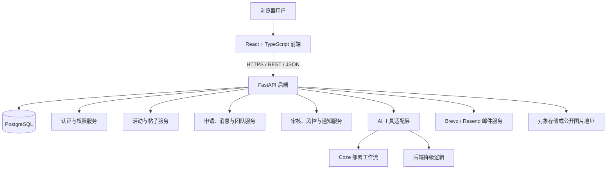
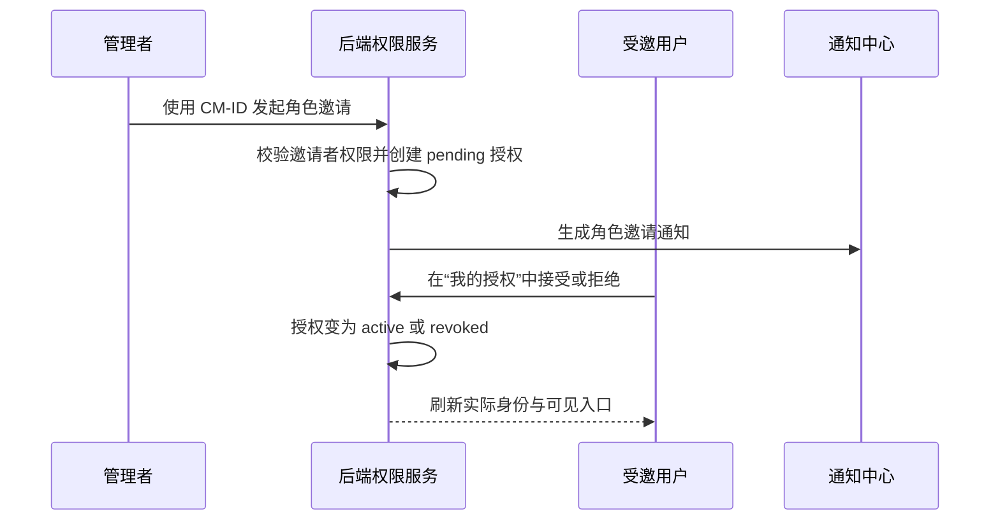
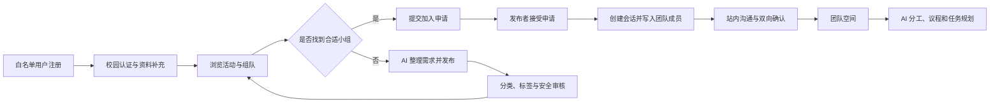
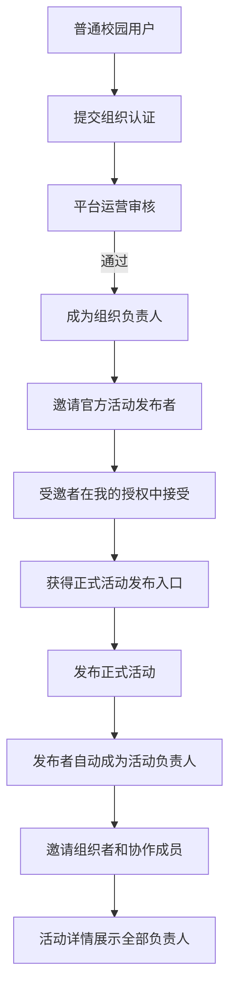

# 梧桐遇 CampusMeet 项目完整总结

> 文档用途：课程验收、项目答辩、成果展示与后续技术交接
> 文档版本：v1.1
> 更新日期：2026-09-14
> 对应代码基线：`cb159df` 及当前课程验收补充版本
> 当前发布状态：白名单内测版


## 1. 项目概览

### 1.1 基本信息

| 项目 | 内容 |
|---|---|
| 中文名称 | 梧桐遇 |
| 英文名称 | CampusMeet |
| 项目定位 | 面向高校学生的可信 AI 活动发现与组队协作平台 |
| 首期服务范围 | 南京大学校内用户与经认证的校园组织 |
| 当前访问方式 | 白名单账号内测，生产环境不开放任意邮箱注册 |
| 前端 | React 18、TypeScript、Vite、Tailwind CSS、Zustand、Axios |
| 后端 | Python 3.12、FastAPI、SQLAlchemy、Alembic、LangGraph |
| 数据库 | 生产环境 PostgreSQL，本地开发可使用 SQLite |
| AI 能力 | Coze 部署工作流与后端降级策略 |
| 部署平台 | Render |
| 桌面交付 | Electron 封装的 Windows x64 安装程序与便携包 |

### 1.2 项目地址

- 项目仓库：<https://github.com/Methyl1644/EL_CampusMate>
- 正式网页：<https://campusmate-web.onrender.com>
- 后端服务：<https://campusmate-api-i3bf.onrender.com>
- 健康检查：<https://campusmate-api-i3bf.onrender.com/health>
- 后端接口文档：<https://campusmate-api-i3bf.onrender.com/docs>
- Coze 封面工作流：<https://sbs68xhstz.coze.site/run>

> 说明：网页与后端使用 Render 免费实例。后端长时间无请求时可能休眠，首次访问可能需要等待约 50 秒或更久。前端会保留尚未提交完成的表单内容，后端恢复后可重试。

### 1.3 名称与视觉含义

“梧桐遇”同时表达校园、南京和相遇三个概念：

- “梧桐”呼应南京城市景观和校园环境；
- “遇”强调发现活动、遇见队友、形成协作关系；
- CampusMeet 直观表达 campus 与 meet 的组合，便于对外介绍；
- 标志由三只相互遮叠的小鲸鱼共同组成梧桐叶轮廓，中央共享向下的尾部，表达不同能力的学生汇聚成队。

仓库早期名称为 CampusMate，因此部分目录名、环境变量和历史代码仍保留 `campusmate` 标识；面向用户的品牌已经统一为“梧桐遇 CampusMeet”。

## 2. 思路产生与问题背景

### 2.1 需求来源

高校学生参加竞赛、科研、课程项目、体育活动和校园组织活动时，经常遇到以下问题：

1. 活动信息分散在学院网站、公众号、群聊和同学转发中，信息可信度与时效性难以判断。
2. 学生知道自己“想参加”，却不清楚应该寻找什么能力的队友，也难以写出完整的招募说明。
3. 普通群聊中的招募信息缺少统一字段，无法按时间、地点、人数和技能进行有效筛选。
4. 陌生同学之间直接交换手机号、微信或 QQ 存在隐私和安全风险。
5. 申请通过并不等于真正成队，后续仍缺少沟通、确认、分工和任务推进机制。
6. 官方活动、组织活动和普通组队帖混杂时，用户难以区分信息来源和发布权限。

### 2.2 从“论坛”到“AI 组队经纪人”

项目最初可以被理解为校园组队信息平台，但仅提供“发帖和评论”不能解决需求表达与成队推进问题。因此产品定位进一步收敛为“AI 组队经纪人”：

```text
活动发现
  -> AI 理解需求
  -> 结构化组队帖
  -> 分类与安全审核
  -> 申请与消息沟通
  -> 双向确认成队
  -> AI 分工与任务规划
```

AI 不代替用户做最终决定，而是负责降低表达、筛选和规划成本。发布、授权、封禁、成队和联系方式解锁仍由后端规则及用户明确操作控制。

### 2.3 产品设计原则

| 原则 | 具体体现 |
|---|---|
| 可信来源 | 区分平台正式活动、认证组织活动与普通用户组队帖 |
| 用户可控 | AI 草稿可编辑，活动和帖子可在发布后继续完善 |
| 最小暴露 | 公开内容不展示敏感联系方式，确认关系后再解锁 |
| 权限分层 | 平台、组织、活动、帖子四级授权，各角色只拥有必要权限 |
| 主流程可降级 | AI 暂时不可用时尽量保留手动操作能力，不让整个业务中断 |
| 可解释 | 匹配给出理由，审核给出提示，授权显示来源与实际身份 |
| 状态可追踪 | 申请、邀请、帖子、活动、团队和通知均使用明确状态流转 |

## 3. 项目目标与创新点

### 3.1 项目目标

1. 建立一个面向南京大学学生的统一活动发现与组队入口。
2. 让用户通过自然语言快速形成字段完整、可筛选的招募内容。
3. 让正式活动具有明确发布来源、负责人和协作者。
4. 打通“浏览、发布、申请、沟通、确认、成队、规划”的完整链路。
5. 在真实校园社交场景中兼顾效率、隐私、安全与治理需求。

### 3.2 主要创新点

#### 创新点一：活动与组队帖分层

系统把“正式活动”和“学生组队”建模为两类关联但不同的内容：

- 活动由平台工作人员或认证组织发布，负责提供权威信息；
- 组队帖由学生发布，用于招募、讨论或活动报名；
- 组队帖可以关联正式活动，并继承活动标签与发布上下文；
- 活动支持官方报名、开放组队、仅展示信息三种参与模式。

#### 创新点二：AI 将自然语言转换为结构化协作需求

用户不必从空白表单开始。AI 会从一句描述中整理活动名称、目标人数、所需角色、每周投入、校区范围、截止时间等字段，并继续追问缺失信息。

#### 创新点三：从“申请成功”延伸到“真正成队”

平台没有在交换联系方式处结束流程，而是继续提供：

- 申请接受与成员写入；
- 站内会话；
- 双向确认；
- 团队空间；
- 成员分工、会议议程、任务清单和风险提醒。

#### 创新点四：多层授权治理

系统使用平台角色、组织角色、活动角色和帖子角色组成权限链条。每次邀请先进入待接受状态，由受邀用户在“我的授权”中确认，避免后台单方面静默赋权。

#### 创新点五：AI 与确定性规则分工

AI 负责语义理解和建议，后端负责身份、权限、状态、敏感信息和数据一致性。该设计避免把高风险业务决定交给不稳定的模型输出。

## 4. 总体架构

### 4.1 系统结构



### 4.2 分层职责

| 层级 | 职责 |
|---|---|
| 前端展示层 | 页面路由、响应式布局、交互反馈、表单状态、调用后端 API |
| API 路由层 | 参数校验、身份读取、统一响应、HTTP 错误映射 |
| 业务服务层 | 权限判断、状态流转、审核、通知、参与规则和数据投影 |
| 工具层 | 帖子、申请、消息、团队和 AI 操作的业务封装 |
| 数据持久层 | SQLAlchemy 模型、事务、索引与 Alembic 迁移 |
| AI 适配层 | Coze 调用、返回解析、超时处理、降级和安全边界 |

### 4.3 核心数据对象

系统主要包含以下数据对象：

- 用户、登录会话、验证码、访问申请；
- 正式活动、组织、组织成员、组织认证申请；
- 组队帖、标签、标签别名、标签提案、收藏；
- 加入申请、会话、消息；
- 团队、团队成员、任务与 AI 规划；
- 平台角色、活动协作者、帖子协作者、邀请和负责人转移；
- 通知、举报、屏蔽、审核案件、账号限制与申诉；
- 上传记录和审计日志。

Alembic 迁移负责生产数据库结构演进，启动命令会先执行迁移再启动 FastAPI 服务。

## 5. 用户角色与授权体系

### 5.1 当前访问控制

生产环境设置 `AUTH_ACCESS_MODE=allowlist`。只有 `AUTH_ALLOWED_EMAILS` 中的内测账号能够注册和登录。该限制用于课程验收和早期测试，不代表系统只能支持四个账号；把访问模式切换为 `public` 后，后端具备开放注册入口，但正式开放前仍需补充运营和容量保障。

初始工作人员通过 `STAFF_EMAILS` 配置。工作人员登录后可被物化为高级平台运营角色，并拥有正式活动发布与平台管理能力。

### 5.2 用户公开短 ID

每位用户都有简短 ID，前端格式为 `CM-数字ID`，例如 `CM-12`。用户在“我的授权”页面可以查看自己的 ID，并把它提供给管理者。管理者通过该 ID 发起邀请，不需要知道对方的邮箱或内部数据库信息。

### 5.3 四级授权模型

| 层级 | 角色 | 主要权限 |
|---|---|---|
| 平台 | `senior_operator` 高级平台运营 | 邀请、暂停和撤销平台角色；管理全站内容和正式活动 |
| 平台 | `operator` 平台运营 | 平台内容运营、组织审核、正式活动管理 |
| 组织 | `owner` 组织负责人 | 管理组织成员与发布者、转移负责人、代表组织管理活动 |
| 组织 | `publisher` 官方活动发布者 | 代表已认证组织发布正式活动 |
| 组织 | `member` 组织成员 | 展示组织成员身份，不自动获得发布权限 |
| 活动 | `manager` 活动负责人 | 编辑活动、管理协作者、管理关联组队内容 |
| 活动 | `editor` 活动组织者 | 编辑活动并协助管理关联内容 |
| 活动 | `coordinator` 活动协作成员 | 协助处理活动下的报名与组队秩序 |
| 帖子 | `editor` 组队帖编辑者 | 编辑帖子、管理申请和状态 |
| 帖子 | `application_manager` 加入申请管理员 | 处理加入申请和招募状态 |

### 5.4 授权流程



平台角色接受时要求用户重新输入当前密码。系统还保护最后一个有效的高级平台运营，避免误操作导致平台无人可管理。

### 5.5 组织认证

已完成校园认证的普通用户可以提交组织官方认证申请，填写组织名称、类型、校内范围、官方邮箱、官方主页、负责人说明和证明材料。平台运营审核通过后，系统建立已认证组织与负责人关系，负责人可以邀请官方活动发布者和普通成员。

## 6. 功能完整说明

### 6.1 注册、登录与校园认证

主要能力包括：

- 邮箱验证码发送与校验；
- 注册、登录、退出和登录会话管理；
- 忘记密码与密码重置；
- 修改密码、停用账号；
- 校园邮箱认证；
- 白名单访问校验；
- 登录后按资料完整度自动导航。

为课程评委提供“快速体验”入口：登录和注册页面会在后端明确开启且未过期时显示该按钮，评委无需填写注册资料即可进入预置游客账号。该账号按工作人员身份完成初始化，可体验正式活动发布、授权管理、组队、消息和团队空间等完整流程。入口不是绕过后端认证的前端快捷方式，而是由后端签发短时会话，并同时校验开关、有效期、白名单、工作人员名单、账号状态、校园认证、资料完成度和平台角色；默认会话最长 2 小时，关闭开关或超过截止时间后按钮自动消失。

验证码邮件通过 Brevo 或 Resend 发送。服务记录发送结果，但邮件服务返回“已投递”只代表接收服务器接受邮件，用户仍可能需要检查垃圾邮件、学校邮箱过滤规则或收件延迟。

### 6.2 新用户资料补充

新用户登录后进入分步资料流程，可填写：

- 昵称、专业、年级；
- 技能标签；
- 兴趣方向与希望寻找的伙伴类型；
- 可投入时间；
- 个人简介、联系方式与可见性设置。

流程支持返回上一步修改信息，并保留已填写内容。完成资料后才能进入主站；已登录用户也可以在设置页继续修改资料。

### 6.3 首页

首页不是营销页，而是登录后的工作台，集中展示：

- 用户资料摘要；
- 截止时间提醒；
- 推荐正式活动；
- 已关注活动；
- 已参加活动；
- 已加入小组；
- 团队任务时间线；
- 未读消息与未读通知数量。

后端以聚合接口一次返回首页所需数据，并对局部数据异常返回 `warnings`，避免一个区域异常导致整个首页不可用。

### 6.4 探索与内容发现

探索页分为“活动”和“组队”两个标签页，二者拥有独立的搜索和筛选状态。

活动支持按以下条件筛选：

- 关键词；
- 活动日期；
- 活动状态；
- 活动类型；
- 校区；
- 标准标签。

组队支持按分类、标签、关键词、排序、帖子类型和关联活动筛选。系统使用受控标签和标签别名，避免同义词造成数据碎片。

### 6.5 正式活动

正式活动由平台工作人员、平台运营或认证组织发布。普通校园用户不会看到正式活动发布入口。

活动内容包括：

- 标题、简称、主办方、届次；
- 简介与完整详情；
- 报名截止、开始和结束时间；
- 地点、校区和人数上限；
- 参与方式、官方来源网址、封面和标签。

尚未确定的时间可以留空，地点可以填写“暂无”。发布后，活动负责人或具有编辑权限的协作者可以继续补足。

活动参与方式包括：

| 模式 | 含义 |
|---|---|
| `official_signup` | 使用官方报名组承载高容量报名 |
| `open_team` | 允许学生围绕该活动发布组队帖 |
| `information_only` | 只展示活动信息，不开放报名或组队 |

发布者创建活动后自动成为活动负责人。活动详情页展示负责人和全部有效协作者，并提供编辑、归档、协作者邀请和关联组队管理入口。

### 6.6 AI 对话式发布组队帖

普通组队帖默认面向校园用户，覆盖竞赛与项目、学习与科研、体育与健身、旅行与户外、校园生活、拼团与 AA 六个主分类。

发布流程如下：

1. 用户用自然语言描述需求。
2. 前端调用 `POST /api/agent/post-draft`。
3. AI 返回回复、结构化草稿和字段完整状态。
4. 用户继续回答问题，或切换到手动表单补充。
5. 发布前执行本地敏感信息筛查与 AI 分类审核。
6. 后端校验参与模式、标签、人数、状态和幂等请求 ID。
7. 发布成功后进入首页、探索页和个人小组列表。

组队帖支持三种用途：

- `team_recruitment`：招募队友；
- `official_signup`：正式活动报名；
- `discussion`：经验交流或活动讨论。

加入方式支持申请审核、直接加入和不开放加入。帖子可以关联正式活动，并继承活动上下文和标准标签。

### 6.7 帖子封面

用户可以上传封面；未提供封面时，后端调用独立的 Coze 图片生成工作流，根据内容类型、标题、描述、分类、地点和所需角色生成 16:9 图片。

Coze 返回的公开 HTTPS 图片地址被写入帖子的 `cover_url`，用于：

- 探索页组队卡片；
- 帖子详情页头图；
- 个人主页和收藏列表中的组队卡片。

后端支持长达 4096 字符的托管图片地址，并识别新版 `status=success/failed` 返回结构；明确返回失败状态时不会保存图片，历史工作流未返回状态但提供有效图片地址时仍保持兼容。图片生成失败时，帖子仍可发布并显示统一占位图；发布者可在“编辑与管理”中点击“生成封面”或“重新生成封面”进行补图。

### 6.8 组队帖发布后管理

发布者和被授权协作者可以根据角色执行：

- 编辑标题、描述、人数、角色、投入时间、校区和截止时间；
- 生成或重新生成封面；
- 关闭招募与重新开放；
- 归档和删除；
- 查看并处理加入申请；
- 邀请组队帖编辑者或申请管理员；
- 查看当前成员和协作管理人员。

系统使用明确的招募状态和权限检查，不依赖前端隐藏按钮作为安全措施。

### 6.9 申请加入

申请表包含意向角色、相关经验、可投入时间、加入原因和可选问题。后端在创建申请时校验：

- 用户与帖子是否存在；
- 用户是否完成认证并允许参与；
- 帖子是否开放、人数是否已满；
- 是否重复申请；
- 角色字段与帖子 ID 类型是否正确；
- 是否触发内容安全或频率限制。

申请状态包括待处理、已接受、已拒绝和已撤回。申请者可以在个人页面查看状态并撤回待处理申请。

发布者接受申请后，系统会：

1. 把申请状态改为已接受；
2. 创建或复用与帖子绑定的团队；
3. 把申请者写入团队成员；
4. 更新帖子当前成员数；
5. 创建或复用双方会话；
6. 给相关用户发送通知。

帖子作者在发布时即作为团队所有者写入成员关系，因此“我发布的小组”会出现在“已加入”和团队列表中。

### 6.10 消息与会话

消息功能用于申请接受后的站内沟通。主要能力包括：

- 会话列表；
- 会话消息分页读取；
- 发送文字消息；
- 关闭会话；
- 双向确认组队；
- 未读状态提示。

当前前端通过 REST 接口读取消息，适合课程演示和内测规模；并未宣称已使用 WebSocket 实时推送。接受申请后自动创建会话，用户从顶部消息入口或 `/messages` 进入。

### 6.11 双向确认与团队空间

当会话双方都确认愿意组队后，系统将关系落入团队空间。团队功能包括：

- 团队详情与成员列表；
- 成员建议角色调整；
- 移除成员与主动退出；
- 转移团队负责人；
- 团队归档；
- 新增、编辑、删除、完成和排序任务；
- AI 分工、首次会议议程和风险提醒。

团队和组队帖通过 `post_id` 关联，成员关系由数据库约束维护。团队任务带有数量与负载限制，避免过大的 AI 结果或异常请求破坏团队页面。

### 6.12 收藏、关注与个人区域

用户可以收藏组队帖、关注正式活动，并在个人区域查看：

- 已参加、已关注和自己负责的活动；
- 已加入、申请中、已收藏和已归档的小组；
- 自己发布的内容；
- 公开个人主页；
- 账号设置和通知偏好。

### 6.13 通知中心

通知采用数据库持久化和事件驱动方式，支持分页、未读计数、单条已读和全部已读。适合通知用户的事件包括：

- 收到或处理加入申请；
- 平台、组织、活动和帖子角色邀请；
- 邀请接受、拒绝、暂停或撤销；
- 组织认证审核结果；
- 负责人转移；
- 举报、限制与申诉处理结果；
- 与团队和内容状态相关的重要变化。

通知服务使用去重键，防止同一业务事件重复生成多条通知。

### 6.14 管理中心与“我的授权”

管理中心根据当前身份显示不同模块：

- 平台角色管理；
- 组织认证审核；
- 组织成员与发布者管理；
- 活动协作者管理。

“我的授权”则面向受邀用户，展示：

- 当前有效身份；
- 平台角色邀请；
- 组织身份邀请；
- 活动协作者邀请；
- 帖子协作者邀请；
- 组织负责人转移邀请；
- 自己提交的组织认证申请。

这两个页面共同完成“管理者发起邀请、受邀者明确接受、权限实际生效”的闭环。

### 6.15 内容治理与安全

系统已实现或预留以下治理能力：

- 内容敏感信息和风险规则筛查；
- AI 语义审核和风险分级；
- 举报、重复举报合并与审核案件；
- 用户屏蔽与取消屏蔽；
- 临时发布限制或全交互限制；
- 用户申诉和运营复核；
- 关键管理操作审计日志；
- 验证码、注册和发布行为的频率与滥用监测。

密码使用 PBKDF2-HMAC-SHA256 加盐哈希保存，登录令牌使用带会话标识的 HMAC-SHA256 JWT。生产环境要求使用至少 32 字符的随机 `JWT_SECRET`。

## 7. 前端实现说明

### 7.1 技术选型

| 技术 | 作用 |
|---|---|
| React 18 | 页面和组件构建 |
| TypeScript | 接口与状态类型约束 |
| Vite | 开发服务器和生产构建 |
| React Router | 登录、首页、探索、详情、消息、管理等路由 |
| Zustand | 登录用户与全局状态 |
| Axios | 后端 API 请求与统一错误处理 |
| Tailwind CSS | 响应式布局与设计令牌 |
| Lucide React | 导航和操作图标 |
| Vitest / Testing Library | 组件、接口和交互测试 |

### 7.2 页面路由

| 路由 | 页面 |
|---|---|
| `/login` | 注册、登录和密码找回 |
| `/onboarding` | 新用户分步资料补充 |
| `/home` | 用户首页工作台 |
| `/discover` | 正式活动与组队探索 |
| `/publish` | AI 对话式组队发布 |
| `/publish/activity` | 有权限用户发布正式活动 |
| `/posts/:id` | 组队帖详情、申请与发布后管理 |
| `/topics/:id` | 正式活动详情与协作者管理 |
| `/messages` | 会话列表与消息 |
| `/teams/:id` | 团队空间与任务 |
| `/my/activities` | 我的活动 |
| `/my/groups` | 我的小组 |
| `/notifications` | 通知中心 |
| `/users/:id` | 用户公开主页 |
| `/settings` | 个人资料和账号设置 |
| `/management` | 分层管理中心 |
| `/authorizations` | 我的身份、申请和待处理邀请 |
| `/tutorial` | 站内使用教程 |

### 7.3 设计与交互特点

- 使用绿色作为校园与梧桐品牌主色，紫色用于关键操作和状态区分；
- 桌面端使用顶部导航与宽屏信息布局，移动端保持可操作的按钮尺寸；
- 活动和组队页均支持加载、空状态、失败重试和占位封面；
- 破损图片会回退到占位图，避免浏览器显示裂图；
- 表单错误尽量显示后端提供的具体原因；
- 长请求期间禁用重复提交，关键发布使用客户端请求 ID 保证幂等；
- 登录和新用户资料页根据认证状态决定下一步，不让用户进入不完整页面。

### 7.4 前后端契约

前端只访问自有 `/api/*` 接口，不直接持有 Coze Token。公共接口路径集中在 `packages/shared/src/constants.ts`，数据类型集中在 `packages/shared/src/types.ts`，从而减少页面内硬编码。

前端构建时通过 `VITE_API_BASE_URL` 指向生产后端。本地开发时可使用 Vite 代理访问端口 3000 的 FastAPI 服务。

## 8. 后端实现说明

### 8.1 技术选型

| 技术 | 作用 |
|---|---|
| FastAPI | REST API、参数校验和 OpenAPI 文档 |
| Pydantic | 请求和响应结构校验 |
| SQLAlchemy | 数据模型、查询和事务 |
| Alembic | 数据库迁移 |
| PostgreSQL | 生产数据持久化 |
| LangGraph / LangChain | AI 工具与智能体编排能力 |
| Requests | Coze 部署 API 调用 |
| Brevo / Resend | 验证码邮件发送 |
| Boto3 兼容接口 | 对象存储上传能力 |
| Pytest | 后端单元、接口和契约测试 |

### 8.2 API 模块

| 模块 | 主要职责 |
|---|---|
| `auth.py` | 注册、登录、验证码、资料、密码和账号生命周期 |
| `home.py` | 首页聚合数据 |
| `explore.py` | 活动和组队发现、筛选与详情 |
| `posts.py` | 帖子创建、修改、状态、直接加入和封面补生成 |
| `content.py` | 正式活动、标签、关注和活动关联组队 |
| `applications.py` | 加入申请、接受、拒绝与撤回 |
| `messages.py` | 会话、消息、确认成队和关闭会话 |
| `teams.py` | 团队、成员、任务、负责人和归档 |
| `notifications.py` | 通知列表、未读计数和已读状态 |
| `identity.py` | 组织认证、组织邀请和负责人转移 |
| `operators.py` | 平台角色邀请、接受、暂停和撤销 |
| `permissions.py` | 活动和帖子协作者授权 |
| `moderation.py` | 举报、屏蔽、审核、限制与申诉 |
| `uploads.py` | 上传记录和封面绑定 |
| `agent.py` | AI 草稿、分类审核、匹配和团队规划入口 |

### 8.3 统一响应与错误处理

正常响应使用统一结构：

```json
{
  "code": 0,
  "message": "ok",
  "data": {}
}
```

请求模型禁止未声明字段，关键列表具有数量上限，字符串具有长度限制。业务错误被转换为明确 HTTP 状态和中文提示；CORS 中间件保证即使异常响应也保留前端所需的跨域头。

### 8.4 数据一致性

系统使用数据库事务和唯一约束处理以下风险：

- 重复发布；
- 重复申请和重复加入；
- 重复收藏和关注；
- 同一角色重复邀请；
- 同一帖子重复创建团队；
- 接受申请后成员数、团队成员和会话状态不一致；
- 并发加入导致超过人数上限。

帖子作者在创建帖子时同步成为团队所有者。历史数据通过 Alembic 回填迁移补齐作者成员关系。

### 8.5 可观测性

后端提供：

- `/health` 健康检查；
- HTTP 请求日志、状态码和耗时；
- Coze 调用成功、未配置、输出无效、提供方失败和超时指标；
- 关键权限与治理操作审计日志；
- Render 日志中的部署、迁移和健康检查状态。

## 9. Coze 工作流说明

### 9.1 集成原则

Coze 只负责 AI 能力，不直接连接前端数据库。调用链为：

```text
前端 -> CampusMeet 后端 -> 输入裁剪与脱敏 -> Coze 工作流
     <- 统一业务响应 <- 输出校验与降级 <- Coze 返回
```

密码、验证码、原始身份证明、认证材料和未脱敏联系方式不会发送给 Coze。工作流输出必须经过后端 Schema 和业务规则校验后才能落库。

### 9.2 工作流一：发布需求整理 `post-draft`

目标：把自然语言转成结构化组队草稿，并指出仍需补充的字段。

主要输入：

- 用户消息；
- 当前草稿；
- 用户技能；
- 帖子类型；
- 字段状态；
- 候选标准标签；
- 关联活动 ID。

主要输出：AI 回复、结构化草稿、缺失字段和是否完整。前端入口是发布页，后端接口是 `POST /api/agent/post-draft`。

### 9.3 工作流二：分类与审核 `classify-review`

目标：为帖子推荐主分类和标准标签，识别库外概念并评估语义风险。

工作流输出不直接决定封禁。后端还会执行确定性敏感信息规则，并按两者中更高的风险等级做最终处理。

### 9.4 工作流三：队友匹配 `match-teammates`

目标：在后端先筛选合法候选人，再由 AI 生成匹配分数和可解释推荐理由。

硬条件由后端处理，包括时间、地点、成员上限、帖子状态和屏蔽关系；AI 负责目标一致性、能力互补和沟通建议等软条件。

### 9.5 工作流四：成队规划 `team-plan`

目标：团队建立后生成可执行的协作起点，包括：

- 成员角色与分工；
- 第一次会议议程；
- 任务清单；
- 里程碑；
- 风险与提醒。

后端只把受控团队上下文发送给工作流，输出经过大小和结构限制后写入团队空间，成员仍可手动修改任务。

### 9.6 工作流五：官方活动抽取 `official-activity-extract`

目标：把官方页面文本整理为标准活动卡字段，供运营人员录入活动时参考。

该能力属于运营辅助，不允许模型自动把网页内容直接发布为官方活动。来源真实性、组织身份和最终发布操作仍由平台人员确认。当前仓库包含工作流设计与 Schema，但普通用户前端没有独立抓取入口。

### 9.7 工作流六：内容封面生成 `cover-generation`

目标：当用户没有上传图片时，根据帖子或活动描述生成横向封面。

调用输入包括：

```json
{
  "content_type": "post",
  "title": "约饭",
  "description": "这周三去新街口拼团吃烤肉",
  "category": "校园生活",
  "location": "新街口",
  "roles": "不限角色"
}
```

当前部署地址由 `COZE_COVER_API_URL` 配置，生产配置指向 `https://sbs68xhstz.coze.site/run`。鉴权 Token 使用独立的 `COZE_COVER_API_TOKEN`，与其他 AI 工作流的 `COZE_DEPLOY_API_TOKEN` 分离。

工作流直接返回图片生成服务托管的公开地址，避免“下载图片、重新上传、再次签名”带来的额外耗时。后端只接受 HTTPS 地址，识别成功或失败状态，并拒绝保存明确失败任务携带的残留地址。

### 9.8 工作流降级策略

AI 工具适配层按可用配置选择：

1. 优先调用对应的 Coze 部署 API；
2. 必要时尝试旧版工作流配置；
3. 再使用本地或 LLM 降级逻辑；
4. 最终给出可继续操作的手动结果或明确错误。

封面生成失败不会阻止帖子发布，而是显示占位图并允许稍后重试。涉及身份、权限、成员关系和联系方式的核心业务不依赖 AI 成功才能保持数据正确。

## 10. 核心业务流程

### 10.1 从注册到成队



### 10.2 正式活动发布与授权



## 11. 部署与运行

### 11.1 生产部署

`render.yaml` 定义两个服务：

1. `campusmate-api`：Python Web Service，构建时安装锁定依赖，启动时执行数据库迁移，然后启动 FastAPI。
2. `campusmate-web`：静态站点，执行 TypeScript 检查和 Vite 构建，所有前端路由重写到 `index.html`。

两个服务都对仓库提交启用自动部署。`main` 分支更新后，Render 拉取代码并完成新版本发布。

### 11.2 关键环境变量

| 变量 | 用途 | 是否敏感 |
|---|---|---|
| `DATABASE_URL` | PostgreSQL 连接 | 是 |
| `JWT_SECRET` | 登录令牌签名 | 是 |
| `AUTH_ACCESS_MODE` | `allowlist` 或 `public` | 否 |
| `AUTH_ALLOWED_EMAILS` | 内测白名单 | 是 |
| `STAFF_EMAILS` | 初始工作人员账号 | 是 |
| `FRONTEND_ORIGINS` | 允许跨域的前端地址 | 否 |
| `BREVO_API_KEY` / `RESEND_API_KEY` | 验证码邮件 | 是 |
| `COZE_DEPLOY_API_TOKEN` | 通用 Coze 部署接口鉴权 | 是 |
| `COZE_*_API_URL` | 各 AI 工作流部署地址 | 否 |
| `COZE_COVER_API_TOKEN` | 封面工作流独立鉴权 | 是 |
| `OBJECT_STORAGE_*` | 用户上传的对象存储配置 | 是 |
| `VITE_API_BASE_URL` | 前端访问的后端根地址 | 否 |
| `REVIEW_DEMO_ENABLED` | 是否显示并开放课程验收快速体验入口 | 否 |
| `REVIEW_DEMO_EMAIL` | 预置游客账号邮箱，须同时位于白名单和工作人员名单 | 是 |
| `REVIEW_DEMO_EXPIRES_AT` | 快速体验入口截止时间 | 否 |
| `REVIEW_DEMO_SESSION_TTL_SECONDS` | 快速体验会话有效时长，后端限制最大值 | 否 |

任何 Token、数据库密码和工作人员邮箱都不应提交到 Git 仓库。

### 11.3 本地运行

环境要求：Python 3.12、Node.js 18 以上版本、Git。

```bash
git clone https://github.com/Methyl1644/EL_CampusMate.git
cd EL_CampusMate
```

后端：

```bash
uv sync --frozen
uv run alembic upgrade head
uv run python src/main.py -m http -p 3000
```

前端：

```bash
cd apps/web
npm ci
npm run dev
```

本地未配置 `DATABASE_URL` 时使用 SQLite。前端开发服务器把 `/api` 请求代理到本地后端；生产环境通过 `VITE_API_BASE_URL` 访问 Render API。

### 11.4 Windows 桌面端交付

项目提供基于 Electron 官方运行时的 Windows x64 封装。桌面程序加载与网页相同的 React 构建产物，并通过本地代理访问 Render 后端，因此网页端的账号、活动、组队、消息、授权和 Coze 能力在桌面端保持一致。构建入口为 `apps/web/scripts/build-windows-exe.ps1`，也可以在 `apps/web` 中执行 `npm run desktop:build`，生成安装程序和便携压缩包。

当前课程验收安装程序为 `CampusMeet-1.0.1-x64-setup.exe`，文件大小约 151.22 MB，SHA-256 为 `8109AB6F3D98B95D64CB8DFD129F94A6BB06E49F9F07B0B0C14256C9371CCD8D`。它仍依赖线上后端和 Coze 服务；断网时不能完成需要服务器的数据操作。

## 12. 效果呈现

### 12.1 用户可见结果

| 场景 | 页面效果 |
|---|---|
| 登录注册 | 左侧品牌区与右侧账号表单，验证码和错误信息明确显示 |
| 新用户资料 | 分步填写并可返回修改，完成后进入首页 |
| 首页 | 活动、截止时间、我的小组、团队任务和未读信息聚合展示 |
| 探索 | 活动与组队分栏，支持搜索、筛选、标签和分页 |
| 正式活动 | 展示来源、主办方、时间地点、参与方式、负责人和关联组队 |
| 组队卡片 | 显示生成或上传的 16:9 封面、分类、人数和状态 |
| 组队详情 | 展示参与要求、所需角色、成员、协作者、申请和管理操作 |
| 消息 | 会话列表和消息区结合，支持沟通与确认组队 |
| 团队空间 | 成员、分工、议程、任务和风险提醒集中展示 |
| 授权中心 | 显示 CM-ID、有效身份和各层待接受邀请 |
| 管理中心 | 按平台、组织和活动权限显示对应管理模块 |

### 12.2 项目形成的实际闭环

当前系统已经把原本分散的多个动作整合为一个可演示流程：

```text
发现可信活动
-> 创建或寻找组队
-> 提交并处理申请
-> 成员真实进入团队
-> 站内沟通
-> 确认合作
-> AI 辅助开始协作
```

相较普通论坛，平台的结果不只是“产生一条帖子”，而是形成可追踪的申请、成员、会话、团队和任务数据。

## 13. 测试与质量保障

### 13.1 测试结构

仓库当前包含 54 个后端 Python 测试文件和 41 个前端测试文件，覆盖范围包括：

- 注册、验证码、白名单、登录会话和账号生命周期；
- 新用户资料流程；
- 活动、帖子、标签、搜索和首页数据；
- 收藏、申请、消息、确认成队和团队任务；
- 平台、组织、活动和帖子权限；
- 通知、举报、限制、申诉和滥用监测；
- Coze 契约、AI 降级、封面生成；
- PostgreSQL 迁移、生产配置和 Render 部署契约；
- React 页面、接口适配、路由和响应式组件。
- 课程验收快速体验入口的开启、关闭、过期、身份校验和前端跳转。

### 13.2 质量手段

- Pydantic 请求校验；
- TypeScript 类型检查；
- Vitest 组件与接口测试；
- Pytest 单元、集成与并发测试；
- Alembic 迁移回放测试；
- OpenAPI 快照和前后端契约检查；
- 生产构建验证；
- Render 健康检查与日志观察。

本文件对应的最新封面集成修改已通过 Coze 返回解析的 3 项定向测试、前端 TypeScript 检查和 Python 语法检查。完整测试数量会随后续提交变化，应以仓库最新 CI 或本地运行结果为准。

## 14. 当前边界与后续规划

### 14.1 当前边界

| 项目 | 当前情况 |
|---|---|
| 用户规模 | 白名单内测，未进行大规模公开运营验证 |
| 后端可用性 | Render 免费实例会休眠，首次请求存在冷启动时间 |
| 消息实时性 | 当前使用 REST 获取，尚未升级 WebSocket |
| 邮件送达 | 依赖第三方邮件服务和学校邮箱过滤策略 |
| Coze 稳定性 | 依赖部署地址、Token、模型额度和提供方响应时间 |
| 官方活动来源 | 以工作人员或认证组织人工确认发布为主 |
| 客户端形态 | 已提供 Windows x64 Electron 封装；尚无 iOS/Android 原生应用 |
| 服务范围 | 首期聚焦南京大学，不主张已经支持跨校治理 |

### 14.2 后续规划

1. 将 Render 后端升级为常驻实例，减少冷启动失败。
2. 为消息增加 WebSocket 或服务端推送，并完善在线状态与未读同步。
3. 建立持续集成流程，在每次合并前自动执行后端测试、前端测试和生产构建。
4. 增加活动来源校验、过期提醒和运营审核看板。
5. 增强 Coze 调用的异步任务、失败重试和结果回调，减少长请求等待。
6. 建立图片 URL 生命周期检查，必要时转存到长期对象存储。
7. 在治理和容量验证完成后，再评估从白名单切换到公开注册。
8. 基于真实使用数据评估匹配准确率、申请转化率和成队成功率。

## 15. 仓库目录说明

```text
EL_CampusMate/
├── apps/web/                 React 前端
│   ├── public/               品牌图形和静态资源
│   └── src/
│       ├── api/              前端 API 客户端
│       ├── components/       通用组件
│       ├── features/         管理、身份等业务组件
│       ├── layouts/          页面布局
│       ├── pages/            路由页面
│       ├── router/           路由和认证导航
│       └── store/            Zustand 状态
├── packages/shared/          前端共享类型和接口常量
├── src/
│   ├── api/                  FastAPI 路由
│   ├── agents/               LangGraph 智能体定义
│   ├── services/             权限、审核、通知等业务服务
│   ├── storage/database/     SQLAlchemy 模型和数据库连接
│   ├── tools/                帖子、申请、消息、团队和 AI 工具
│   ├── utils/                认证、邮件和安全工具
│   └── main.py               后端入口
├── migrations/               Alembic 数据库迁移
├── coze/
│   ├── workflows/            工作流设计
│   ├── prompts/              提示词
│   ├── schemas/              输入输出 Schema
│   ├── evals/                JSONL 评测集
│   └── examples/             演示输入输出
├── scripts/                  数据初始化和维护脚本
├── tests/                    后端测试
├── docs/                     产品、接口、演示和总结文档
├── render.yaml               Render 部署声明
├── pyproject.toml            Python 依赖
└── README.md                 仓库入口说明
```

## 16. 团队协作与工程过程

项目按照产品、前端、后端安全和智能体四类职责协同：

| 角色 | 主要工作 |
|---|---|
| A：产品与设计 | PRD、用户流程、页面定义、验收标准和演示故事线 |
| B：前端 | React 页面、响应式交互、状态管理和接口接入 |
| C：后端与安全 | API、数据库、身份权限、审核、通知和部署 |
| D：智能体与算法 | Coze 工作流、Prompt、Schema、评测集和 AI 接口对账 |

开发使用 Git 分支和提交记录追踪功能演进。`main` 对应稳定部署版本，功能开发和修复在独立分支完成后同步到发布分支。接口变化应同时更新共享类型、接口常量与文档。

## 17. 总结

梧桐遇 CampusMeet 从校园活动与组队的真实痛点出发，把活动信息、需求表达、可信身份、申请沟通和团队协作整合到一个系统中。项目的核心价值并非单一 AI 对话，而是让 AI 在受控边界内参与完整业务闭环：

- 用 AI 降低需求表达和内容整理成本；
- 用确定性后端保证身份、权限和成员关系正确；
- 用活动、组织和角色授权建立可信来源；
- 用申请、消息、确认和团队空间推动关系真正落地；
- 用通知、审核、审计和降级策略保证系统可治理、可解释、可继续运行。

当前版本已经形成可部署、可演示、可继续扩展的全栈项目基础。它既能作为课程验收中的完整成果，也为后续扩大用户范围、改进实时通信和优化 AI 工作流提供了清晰的工程边界。
