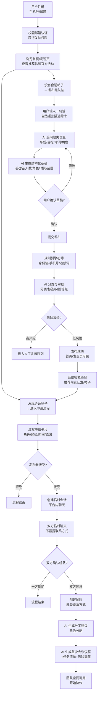

# CampusMate AI 用户主流程文档

> 版本：v1.0  
> 负责人：角色A（产品与设计）  
> 日期：2026-08-08  
> 状态：初稿，待团队评审

---

## 1. 流程总览

用户从"想参加活动"到"组成团队"的完整旅程，共 7 个阶段：

```
注册认证 → 浏览发现 → AI发帖 → 审核分类 → 匹配推荐 → 申请沟通 → 双向确认成队
                                                                    ↓
                                                            AI成队规划
```

---

## 2. 流程图



---

## 3. 各阶段详细说明

### 阶段一：注册与认证

| 步骤 | 用户操作 | 系统响应 | AI 介入 |
|------|---------|---------|---------|
| 1.1 | 输入手机号/邮箱注册 | 创建账号，状态为"未认证" | 无 |
| 1.2 | 填写基础资料（昵称、专业、年级） | 保存到用户表 | 无 |
| 1.3 | 选择技能标签（Python、建模、英语写作等） | 保存到用户技能表 | 无 |
| 1.4 | 校园邮箱认证 | 发送验证邮件，验证后升级为"校内认证" | 无 |

**状态流转**：`未认证 → 校内认证`

**注意事项**：
- 未认证用户只能浏览，不能发帖和申请
- 认证材料不长期保存，只保存认证结果

---

### 阶段二：浏览与发现

| 步骤 | 用户操作 | 系统响应 | AI 介入 |
|------|---------|---------|---------|
| 2.1 | 打开首页 | 展示推荐帖子、官方活动、热门内容 | AI 匹配推荐（P1） |
| 2.2 | 进入发现页 | 展示分类筛选、标签搜索 | 无 |
| 2.3 | 按分类/标签筛选 | 返回匹配的帖子列表 | 无 |
| 2.4 | 点击帖子卡片 | 进入帖子详情页 | 无 |

**页面入口**：
- 首页 `/home`
- 发现页 `/discover`
- 详情页 `/posts/:id`

---

### 阶段三：AI 对话式发帖

| 步骤 | 用户操作 | 系统响应 | AI 介入 |
|------|---------|---------|---------|
| 3.1 | 点击"发布"按钮 | 进入发布页 `/publish` | 无 |
| 3.2 | 输入一句话描述需求 | 前端调用 `POST /api/agent/post-draft` | **工作流①：发布需求** |
| 3.3 | — | AI 返回追问问题 + 结构化草稿 | AI 分析缺失字段并追问 |
| 3.4 | 回答追问 / 修改草稿 | AI 更新草稿 | AI 持续补全信息 |
| 3.5 | 确认发布 | 提交到审核流程 | 无 |

**AI 追问示例**：
```
用户输入："我想参加美赛，现在还缺两个队友，最好一个会写代码，一个英语比较好。"
AI 追问："参赛年份是什么？每周可投入多长时间？对队友的学科基础有什么要求？"
AI 草稿：{
  "activity_name": "数学建模竞赛",
  "target_members": 3,
  "needed_roles": ["编程", "英文写作"],
  "weekly_hours": "待确认",
  "school_scope": "南京大学优先"
}
```

**关键约束**：
- AI 可以多次追问，直到关键字段补全
- 用户可以跳过追问直接发布（缺失字段标注"待确认"）
- 草稿确认前所有内容可编辑

---

### 阶段四：审核与分类

| 步骤 | 触发 | 系统响应 | AI 介入 |
|------|------|---------|---------|
| 4.1 | 帖子提交 | 规则引擎初筛（身份证号、手机号、违禁词、精确住址） | 无 |
| 4.2 | 初筛通过 | 调用 `POST /api/agent/classify-review` | **工作流②：分类与审核** |
| 4.3 | — | AI 返回分类、标签、风险等级、修改建议 | AI 语义判断 |
| 4.4 | — | 判断风险等级 | — |
| 4.5 | 低风险 | 自动发布，首页/发现页可见 | 无 |
| 4.6 | 高风险 | 进入人工复核队列 | 无 |

**状态流转**：`草稿 → 待审核 → 已发布 / 待人工复核 / 已拒绝`

**安全规则**：
- 公开帖禁止直接出现手机号、微信、QQ、身份证号、精确住址
- 线下、金钱、长途、夜间场景增加额外提示
- AI 只负责识别和解释风险，最终封禁/发布由系统规则决定

---

### 阶段五：智能匹配与推荐

| 步骤 | 触发 | 系统响应 | AI 介入 |
|------|------|---------|---------|
| 5.1 | 帖子发布成功 | 系统进行确定性筛选 | 无 |
| 5.2 | 用户浏览帖子 | 调用匹配工作流 | **工作流③：智能匹配** |
| 5.3 | — | 返回匹配分数 + 推荐理由 + 提醒事项 | AI 语义匹配 |

**匹配机制**：

**第一层：确定性筛选（硬条件）**
- 时间是否冲突
- 地点是否可接受
- 队伍是否仍有空位
- 技能是否满足
- 截止时间是否已过

**第二层：语义匹配（软条件）**
- 目标一致性
- 能力互补
- 经验适配
- 每周投入时间
- 沟通方式和工作习惯

**输出示例**：
```json
{
  "score": 87,
  "hard_conflicts": [],
  "reasons": [
    "对方有英文论文经验",
    "每周投入时间接近",
    "目标均为冲奖"
  ],
  "reminders": ["对方只接受线下讨论，建议先确认地点"]
}
```

---

### 阶段六：申请与临时聊天

| 步骤 | 用户操作 | 系统响应 | AI 介入 |
|------|---------|---------|---------|
| 6.1 | 在帖子详情页点击"申请加入" | 弹出申请卡片 | 无 |
| 6.2 | 填写角色、经验、可投入时间、原因、问题 | 提交申请 | 无 |
| 6.3 | — | 通知发布者 | 无 |
| 6.4 | 发布者查看申请 | 可接受或拒绝 | 无 |
| 6.5 | 发布者接受 | 创建临时会话 | 无 |
| 6.6 | 双方进入临时聊天 | 平台内文字聊天 | 无 |

**状态流转**：
- 申请：`待处理 → 已接受 / 已拒绝`
- 会话：`创建 → 活跃 → 已结束`

**关键约束**：
- 临时聊天阶段 **不显示** 手机号、微信、QQ
- 任何一方可随时结束会话或拉黑对方
- 首期使用轮询，后续可升级 WebSocket

---

### 阶段七：双向确认与成队

| 步骤 | 用户操作 | 系统响应 | AI 介入 |
|------|---------|---------|---------|
| 7.1 | 在聊天中点击"愿意组队" | 记录己方确认 | 无 |
| 7.2 | 对方也点击"愿意组队" | 双方确认完成 | 无 |
| 7.3 | — | 创建团队，解锁联系方式 | 无 |
| 7.4 | — | 自动触发成队规划 | **工作流⑤：成队规划** |
| 7.5 | — | AI 返回分工、议程、任务、风险 | AI 规划 |
| 7.6 | 查看成队页 | 展示分工建议、会议议程、任务清单、风险提醒 | 无 |

**状态流转**：
- 确认：`单方确认 → 双方确认`
- 团队：`创建 → 活跃 → 已解散`

**关键约束**：
- 联系方式 **只在双向确认后** 才解锁
- 团队创建后自动触发 AI 成队规划
- AI 规划仅供参考，成员可自行调整

---

## 4. 异常流程

### 4.1 AI 工作流调用失败

| 场景 | 系统行为 |
|------|---------|
| 发帖草稿生成失败 | 提示"AI 暂时不可用，可手动填写表单发布" |
| 分类审核失败 | 提示"审核服务暂时不可用，帖子进入待审核队列" |
| 匹配推荐失败 | 提示"暂时无法生成推荐理由，可查看基础匹配条件" |
| 成队规划失败 | 提示"暂时无法生成规划建议，团队已创建成功" |

**原则**：Coze 调用失败时，后端返回可继续操作的兜底结果，不阻塞主流程。

### 4.2 用户中途退出

| 场景 | 系统行为 |
|------|---------|
| 发帖中途退出 | 保存草稿，下次进入可继续 |
| 申请未提交退出 | 不保存，需重新填写 |
| 聊天中退出 | 会话保持活跃，消息不丢失 |
| 单方确认后退出 | 确认状态保持，等待对方确认 |

### 4.3 帖子状态变化

| 场景 | 系统行为 |
|------|---------|
| 帖子已满员 | 详情页显示"已满员"，不可申请 |
| 帖子已截止 | 详情页显示"已截止"，不可申请 |
| 发布者关闭帖子 | 详情页显示"已关闭"，不可申请 |
| 申请被拒绝 | 申请人收到通知，可申请其他帖子 |

---

## 5. 角色视角对比

### 5.1 发帖者视角

```
登录 → 发布需求 → AI追问补全 → 确认发布 → 等待审核通过
→ 收到申请 → 查看申请详情 → 接受 → 临时聊天 → 确认组队
→ 解锁联系方式 → 查看AI分工建议 → 开始协作
```

### 5.2 申请者视角

```
登录 → 浏览帖子 → 查看匹配推荐 → 选择帖子 → 查看详情
→ 申请加入 → 等待接受 → 临时聊天 → 确认组队
→ 解锁联系方式 → 查看AI分工建议 → 开始协作
```

---

## 6. 变更记录

| 版本 | 日期 | 修改人 | 内容 |
|------|------|--------|------|
| v1.0 | 2026-08-08 | 角色A | 初稿创建 |
